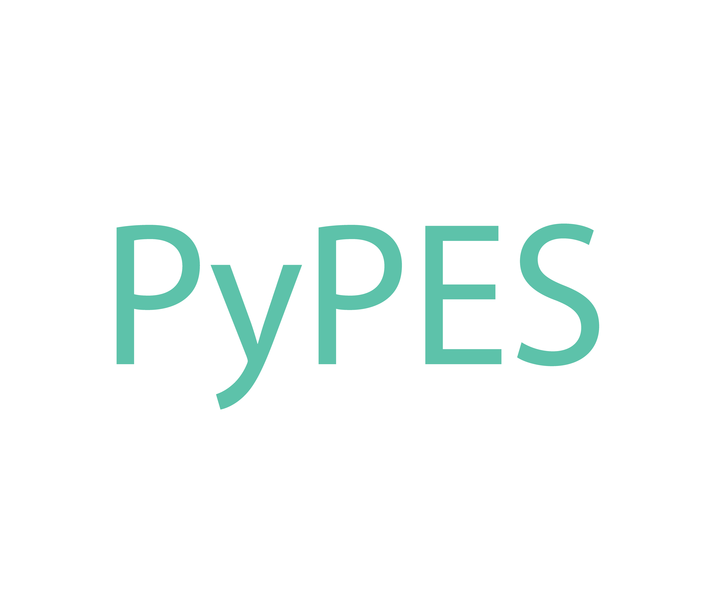

+-----------------------+
| **``Documentation``** |
+=======================+
| |Documentation|       |
+-----------------------+

.. |Documentation| image:: https://img.shields.io/badge/api-reference-blue.svg
   :target: https://stupefied-bhabha-ce8a9f.netlify.com/

Installation
============

The simplest way to install the package is using pip. While this repository
is private, you can install with pip by pointing pip to the URL of the repository
as:

.. code::bash

pip install --process-dependency-links -e

Once this project is published on PyPI, you can install by using

.. code::bash

pip install --process-dependency-links pypes

You will need to install into a Python interpreter with version 3.5 or higher. Note that the
`--process-dependency-links`

Alternative Installation Directions
===================================

If for whatever reason you do not want to install the project as a package but would
like to import it locally, legacy install instructions are available in the first section
of `README.legacy.rst`.

Additional Suggested Steps
^^^^^^^^^^^^^^^^^^^^^^^^^^

0. Clone or duplicate the folder structure in the repository `arpes-analysis-scaffold`,
   skipping the example folder and data if you like
1. Install and configure standard tools like Jupyter_.
2. Follow instructions for import below
3. Explore the documentation and example notebooks at `the documentation site`_.

.. _Jupyter: https://jupyter.org/
.. _the documentation site: https://stupefied-bhabha-ce8a9f.netlify.com/

Optional Steps
^^^^^^^^^^^^^^

0. If you are using Jupyter Lab as opposed to Jupyter, installation of
   the nbextensions: to do this install nodejs from nodejs.org and
   restart Then open a terminal and run the labextension installation

Advanced Configuration + Tips
=============================

Installing Python through Conda
-------------------------------

1. Install ``conda`` through the directions listed at
   `Anaconda <https://www.anaconda.com/download/>`__, you want the
   Python 3 version.
2. On UNIX like environments, create a Python 3.5 environment using the
   command
   ``conda create -n {name_of_your_env} python=3.5 scipy jupyter``. You
   can find more details in the conda docs at the `Conda User
   Guide <https://conda.io/docs/user-guide/tasks/manage-environments.html>`__.
   For Windows Users, launch Anaconda Navigator and create an
   environment.
3. In order to use your new environment, you can use the scripts
   ``source activate {name_of_your_env}`` and ``source deactivate``. Do
   this in any session where you will run your analysis or Jupyter. For
   Windows Users or users of graphical conda, launch your environment
   from the Navigator.

``local_config.py``
-------------------

The local configuration allows you to override the settings that are
committed to the repository and therefore shared. You can use this to
as adjust settings on various interactive tools. For reference, Conrad’s
looks like:

::

   SETTINGS = {
       'interactive': {
           'main_width': 600,
           'marginal_width': 300,
           'palette': 'magma',
       },
   }

IPython Kernel Customization
----------------------------

If you don’t want to have to import everything all the time, you should
customize your IPython session so that it runs imports when you first
spin up a kernel. There are good directions for how to do this online,
but a short version is:

1. Create an IPython profile, use this to start your notebooks
2. In ``~/.ipython/profile_default/`` make a folder ``startup``
3. Add the files
   ``~/.ipython/profile_default/startup/00-add-arpes-path.py`` and
   ``~/.ipython/{Your profile}/startup/01-common-imports.ipy`` according
   to the templates in ``ipython_templates``. See in particular note
   above about setting the environment variable using this file.
4. Customize to your liking

Note that you can customize the default profile or a different if you
wish instead.

It is important that the filenames you put are such that
``-add-arpes-path`` is lexographically first, as this ensures that it is
executed first. The ``.ipy`` extension on ``01-common-imports.ipy`` is
also essential. Ask Conrad if any of this is confusing.

Generate Documentation
======================

1. Refresh Sphinx sources with ``sphinx-apidoc``:
   ``python -m sphinx.apidoc --separate -d 3 --tocfile toc -o source arpes --force``
2. Build Sphinx documentation to ReStructuredText:
   ``make clean && make rst``
3. Convert ReStructuredText to Markdown: ``./source/pandoc_convert.py``
4. Run ``docsify``: ``docsify serve ./docs``
5. As desired publish to docs site

Copyright
=========

Copyright |copy| 2018 by Conrad Stansbury, all rights reserved.