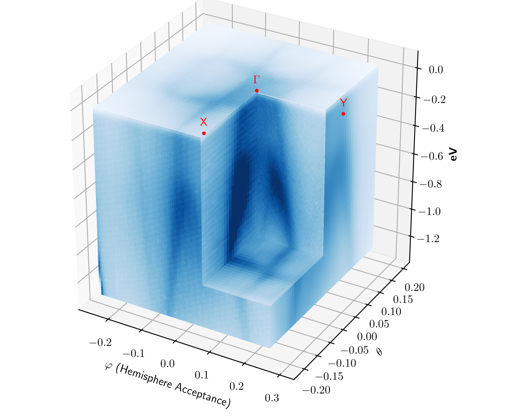

# Plots Cut Through 3D Datasets

PyARPES provides 3D cut plots to illustrate the Femri Surface, and high symmetry
direction dispersion at the same time.

Support is currently rudimentary in that the cut directions must be orthogonal, 
but an intrepid user could easily add support for arbitrary cuts using
`.S.select_around_data` or `.S.along` and some geometry.

The current version can be found in `arpes.plotting.dispersion.cut_dispersion_plot`
and requires just the data and the location of the constant energy cut via `e_floor=`.

