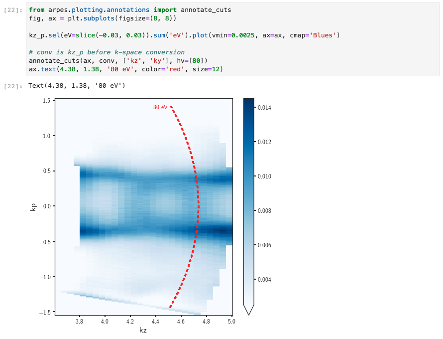

# Plot Annotation Tools

PyARPES has tools, in addition to those provided through 
[Matplotlib](https://matplotlib.org), to add fairly general text based
annotations to plots. 

Additionally, PyARPES includes tools to add annotations purpose built for
ARPES applications, including plotting cut planes and lines onto higher 
dimensional datasets, as when indicating the location of a particular photon
energy plane on a kz dependence.

## Annotating a point on a plot

`arpes.plotting.annotations.annotate_point` is a thin wrapper around
`matplotlib.Axes.text`. You can use it to place both a marker and a text 
label for a particular point.

## Annotating cuts onto ARPES plots

Using `arpes.plotting.annotations.annotate_cuts` you can plot the 
location of constant angle or constant photon energy cuts onto higher 
dimensional datasets. Internally, this is handled by forward converting the
*coordinates* of a piece of data to obtain the surface sampled by the experiment
on the higher dimensional dataset.

We can use this to plot a line of constant angle onto a Fermi surface

or a line of constant photon energy onto a kz dependence.

These techniques can be used to highlight the location in k-space of a particular
ARPES cut.