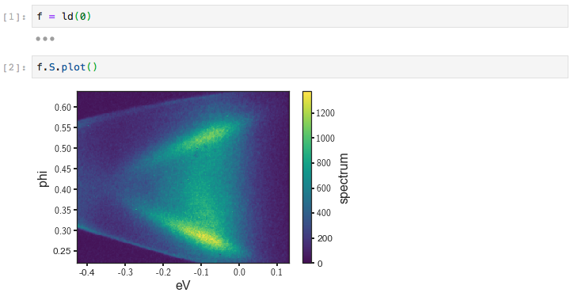
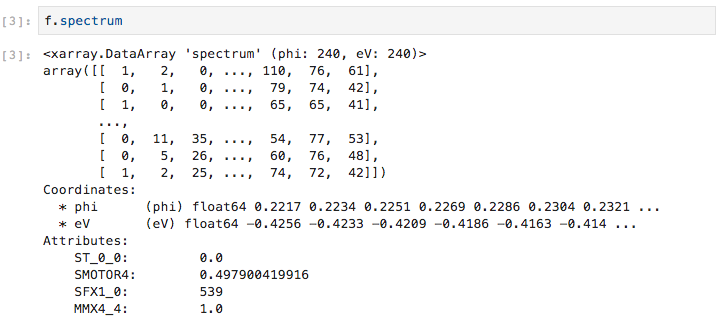
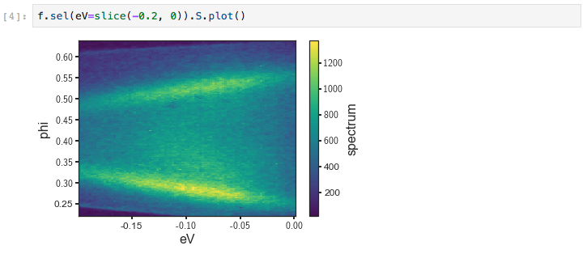
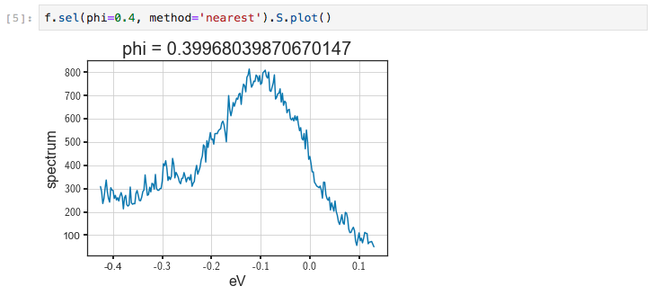
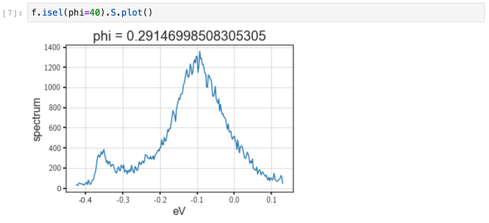
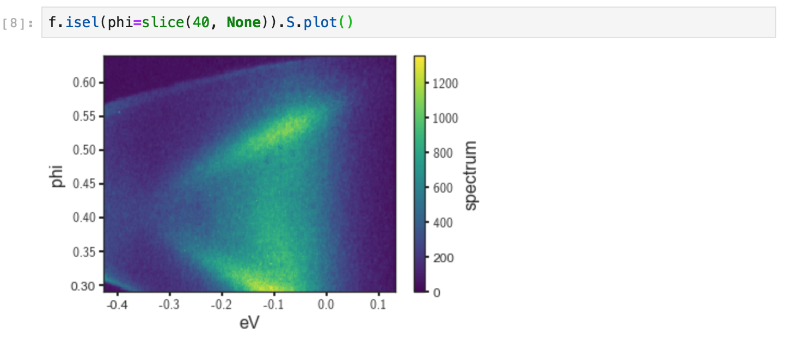
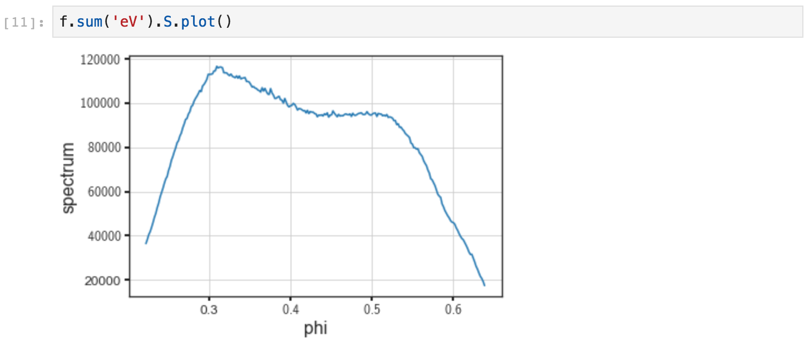

# Loading data for manipulation

First we will load an plot some data.



Although we can plot the spectrum off of a `Dataset`, which might contain additional
attributes like the photocurrent, beam current, temperature, or wall-clock time, by using `.S.plot()`,
we can also get the spectrum attribute from the full data: 



As we can see, it has dimensions `phi` and `eV` with sizes 240x240 along these dimensions.
A subset of the raw data is printed below, as well as subsets of the coordinates and attributes.
With the spectrum in hand, we can plot it directly with `f.spectrum.plot()`. 

# Subselecting Data

Typically, we will not want to use the full spectrometer window. Instead we will want to focus on a particular
energy or momentum range, such as the region just above, below, or around the chemical potential,
or at the energy distribution curves (EDCs) around a particular significant momentum. Data selections 
can be performed either on `Dataset`s or `DataArray`s. In the former case, it has the effect of selecting on a 
particular dimension or set of dimensions for each attribute that has those dimensions. 

In general, we do not need to know the indices of the region we want to select: we can use the physically 
meaningful coordinates. As an example, to get the band structure from our data `f` between the ground reference 
of the spectrometer (the chemical potential) and a point 200 millivolts below, we can use `.sel` 



`.sel` accepts any number of dimensions specified by a `slice`. The arguments to the slice provide a low and high
cutoff respectively.

We can also select just a single point along an axis by passing a value instead of a slice. In general we will want 
to be safe and pass the `method='nearest'` argument, in order to ensure that if the exact value we requested is not 
included, we will get the nearest pixel. 



## Subselecting via indices

In instances where you would like to subselect by an index (ranging above from 0 to 239), as opposed to 
the physically significant coordinate value, we can use `.isel` instead.



## Open ended selections

Selections can be made open ended on one or both sides by passing `None`. In the follow example,
the inclusion of `None` will cause the selection to continue to the end of the data on the high end, i.e
pixels 40 to 240 on the 'phi' axis. 



# Summing

You can sum one or more dimensions at once with the `.sum` method:



To sum along multiple axes you can pass a list, as an example:

```python
f.sum(['eV', 'phi'])
```

**Caveat:** Summing an axis will remove all attributes unless the `keep_attrs=True` parameter is included in the 
call to `.sum`. Forgetting to do this where it is necessary can cause issues down the line for analysis that requires
access to the attributes, such as in converting to momentum space, where the photon energy and coordinate offset for
normal emission are stored as attributes.

# Transposing

To transpose axes, you can use `.transpose`. Because in general you will use axis names in order to interact 
with data, this is rarely necessary except when plotting.


# Interactively Viewing Data

Facilities are included for doing interactive data exploration and analysis both directly in Jupyter, via Bokeh.
And in a separate standalone window using PyQt5. To learn more about interactive analysis, please read the 
[interactive analysis](/interactive) section of the documentation. If you have Bokeh/PyQt5 installed, you can give things a
try by running either ``f.S.show()`` or `qt_tool(f)`.

 
 

# More Info

Additional information about basic data manipulation can be found on the 
[xarray documentation site](http://xarray.pydata.org/en/stable/). Once you are comfortable 
selecting data, you should continue to the other topics in the table of contents.