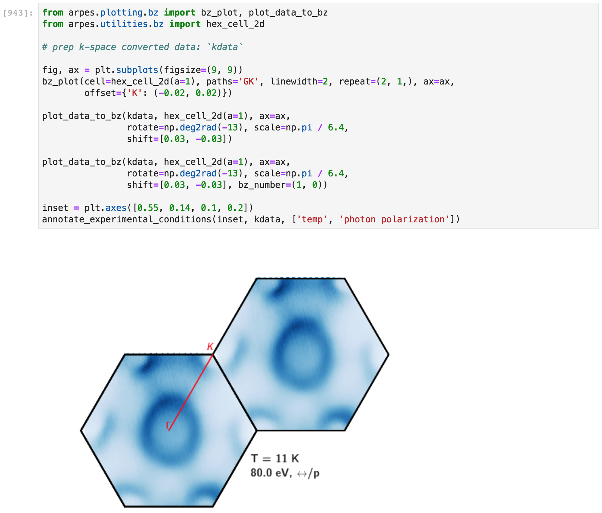
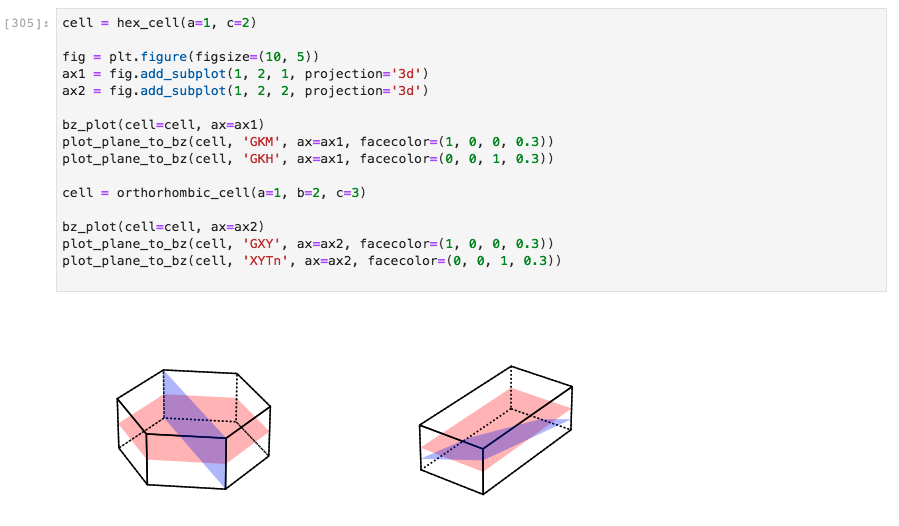
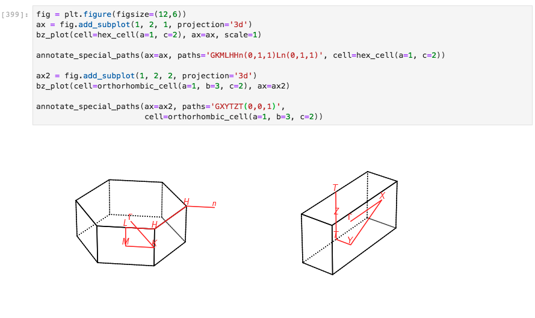

# Brillouin Zones

Some support for calculating and plotting Brillouin zones in PyARPES is included via [ASE](https://wiki.fysik.dtu.dk/ase/), 
the Atomic Simulation Environment. You will need to install `ase` as an optional dependency, for instance via `pip`,
in order to use functions associated with plotting Brillouin zones in PyARPES.

Importantly, PyARPES wraps two functions `bz2d_plot` and `bz3d_plot` from `ase.dft.bz` for 
displaying Brillouin zones in 2 and 3 dimensions. These functions include additional functionality 
to plot additional zones (the `repeat=` parameter), to change rendering settings, and to provide a consistent interface with the 
rest of the plotting utilities in PyARPES.

## Plotting zones in 2D and 3D

## Plotting ARPES data onto 2D zones

As an example, we can plot low temperature ARPES data of 2H-NbS2 onto the 
appropriate hexagonal Brillouin zone. The data must first be converted to momentum space, 
stored here as `kdata`.

Additional Brillouin zones can be addressed with the `bz_number`parameter.

**Note:** PyARPES does not currently support plotting data onto 3D Brillouin zones, but 
we anticipate that this will be supported in future releases.  
 
## Plotting cut locations onto 3D zones

Frequently it is beneficial to indicate the schematic location of a 2D arpes cut onto the 
3D zone, neglecting the dispersion of **k**z in the case of 
in-plane momentum maps.

## Plotting paths through 2D and 3D zones

Paths through zones can also be plotted. PyARPES supports paths defined by high symmetry 
points (`G`, `Y`, `L`, etc.), as well as the negatives of these points (as vectors relative to zone 
center), for instance `Gn`. Furthermore, you can access symmetry points in second and higher zones,
with `K(1, 0, 0)` in 3D or with `G(0, 1)` in two dimensions, as examples.   

