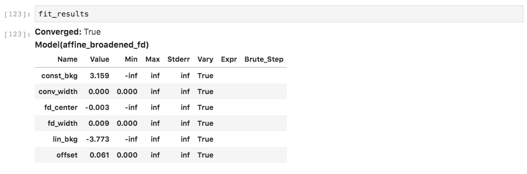
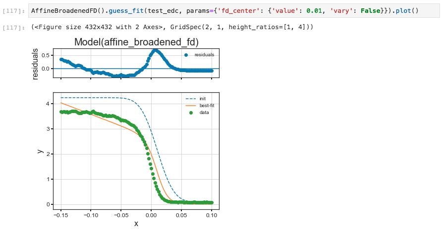
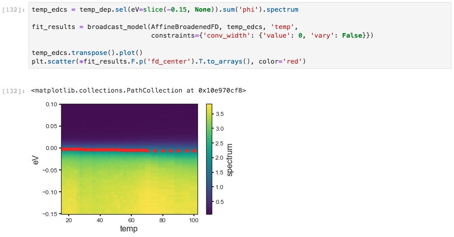
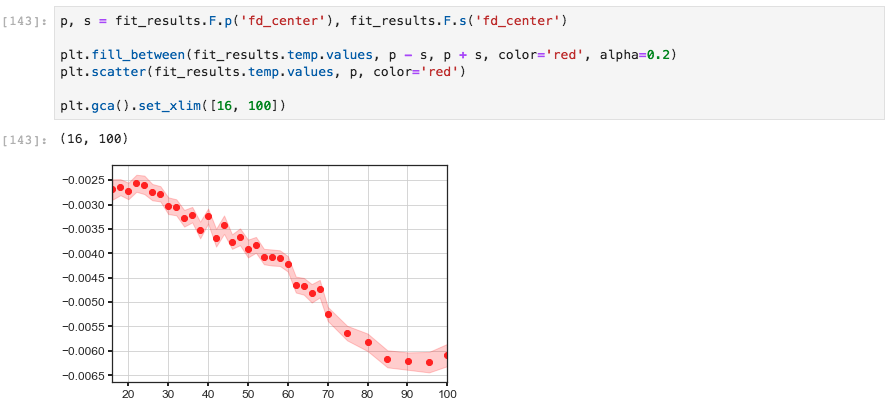
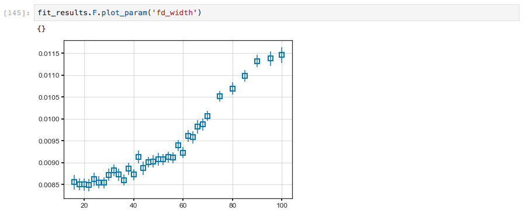
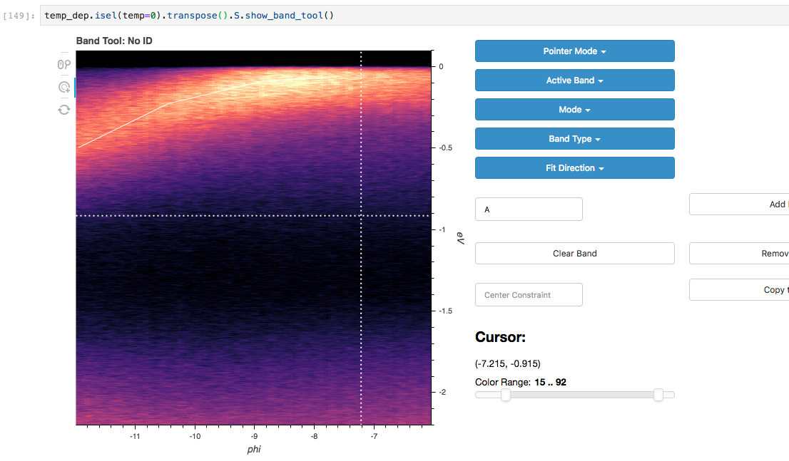

# Curve Fitting in PyARPES

## Why curve fit

Curve fitting is an extremely important technique in angle resolved-photoemission 
because it provides a coherent way of dealing with sometimes noisy data, allows for simple 
treatment of backgrounds, avoids painful questions of interpretation inherent with some
techniques, and grants access to the rich information ARPES provides of the single particle
spectral function.

## Simple curve fitting

PyARPES uses `lmfit` in order to provide a user friendly, compositional API for curve fitting. 
This allows users to define more complicated models using operators like `+` and `*`, but also
makes the process of curve fitting transparent and simple.

Here we will prepare an EDC with a step edge, and fit it with a linear density of states multipled
by the Fermi distribution and convolved with Gaussian instrumental broadening (`AffineBroadenedFD`).
In general in PyARPES, we use extensions of the models available in `lmfit`, which provides an `xarray`
compatible and unitful fitting function `guess_fit`. This has more or less the same call signature as
`fit` except that we do not need to pass the X and Y data separately, the X data is provided by the
dataset coordinates. 

The results of a fit should also provide a useful summary table if you print them in Jupyter.

Using the `params=` keyword you can provide initial guess with `value`, enforce a `max` or `min`, 
and request that a parameter be allowed to `vary` or not. In this case, we will force a fit with 
the step edge at 10 millivolts, obtaining a substantially worse result. 

A number of models already exist including lineshapes, backgrounds, and step edges. All of these 
can also be easily composed to handle several lineshapes, or convolution with instrumental resolution:

* `arpes.fits.fit_models.GaussianModel`
* `arpes.fits.fit_models.VoigtModel`
* `arpes.fits.fit_models.LorentzianModel`
* `arpes.fits.fit_models.AffineBackgroundModel`
* `arpes.fits.fit_models.GStepBModel` - for a Gaussian convolved low temperature step edge
* `arpes.fits.fit_models.ExponentialDecayModel`
* `arpes.fits.fit_models.ConstantModel`
* `arpes.fits.fit_models.LinearModel`
* `arpes.fits.fit_models.FermiDiracModel`
* `arpes.analysis.gap.AffineBroadenedFD` - for a linear density of states with 
  Gaussian convolved Fermi edge
  
Adding additional models is very easy, especially if they are already part of the large library of 
models in `lmfit`. If you are interested, have a look at the definitions in `arpes.fits.fit_models`.

## Broadcasting fits

While curve fitting a single EDC or MDC is useful, often we will want to repeat an analysis across some
experimental parameter or variable, such as the binding energy to track a dispersion, or across temperature
to understand a phase transition.

PyARPES provides a tool, `broadcast_model` that allows for automatic and compositional curve fitting across 
one or more axes of a Dataset or DataArray. As before, you can use the `constraints=` keyword to 
enforce constraints or specify initial guesses for the fitting parameters. Broadcasts can be performed 
over a single dimension (`str`) or a list of dimensions (pass `[str]`). Here we demonstrate performing 
the fitting procedure as a function of the sample temperature, and then plot the step edge 
location onto the data.

In the above, we also used the `.F` extension to `xarray` in order to get the concrete values of the
`fd_center` fit parameter as an array. This is necessary because the result of a broadcast fit is a 
Dataset containing the full data, the residual, and the results. The results attribute is itself a 
DataArray whose values are the full results of the fit, rather than any single of the values.

Because of the rich information provided by a broadcast, PyARPES also has facilities for interacting with
the results of an array of fit results more simply, furnished by the `.F` attribute.  

## The .F attribute

You can get all the parameter names with `.parameter_names`.

### Getting fit values

Using the `.F` attribute we can obtain the values for (`p`) as well as the fit error of (`s`) any 
fit parameters we like.

### Quickly plotting a fit

We can also quickly plot a fit result with `plot_param`. This is sometimes useful for immediately 
plotting a fit result onto data or another plot sequence.

## Examining fit quality interactively

Fit results can also be explored interactively with `.F.show()`, similar to `.S.show` for spectra.

## Fitting complex lineshapes semi-interactively

In addition to looking at the results of fits interactively, you can also lay down lineshapes for 
one or more dispersive bands with `.S.show_band_tool()`. Follow roughly the information provided for
masking to get started. The "Center Constraint" value dictates how much the lineshape is allowed to
vary from the approximate location you lay down.

Using the "Mode" setting, you can choose whether EDCs or MDCs will be fit. Should more than one band
(or the same band more than once) cross a given EDC or MDC during the fit, the appropriate number
and location of lineshapes will be used. As a result of one band crossing an EDC or MDC more than once,
the fit parameters will be postfixed with `_{number}` to indicate the index of the crossing.   

    
