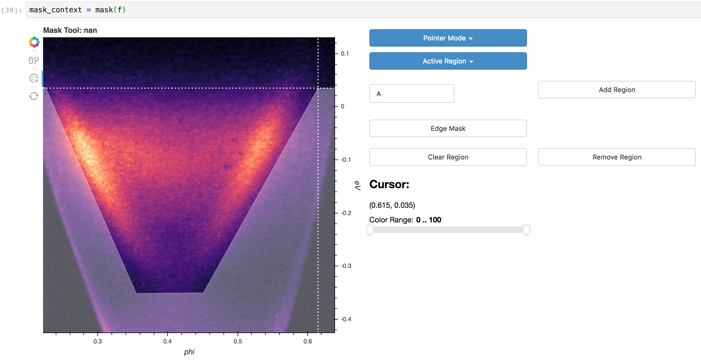
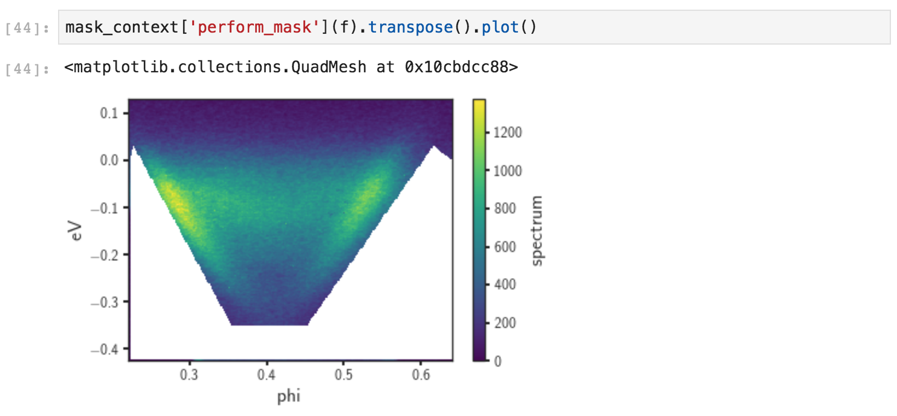
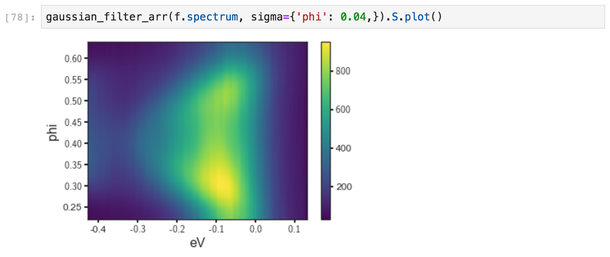

# Intermediate Data Manipulation

Topics covered will include:

1. Rebinning data
2. Normalizing along an axis or axes
3. Masking
4. Selecting along paths
5. Basic background subtraction
6. Smoothing
7. Derivatives + minimum gradient

## Data rebinning

Frequently it makes sense to integrate in a small region around a single value of 
interest, or to reduce the size of a dataset uniformly along a particular axis of set
of axes. Rebinning the data can be used to accomplish both:

Arguments passed into rebin after the first will be matched to dimensions on the input data.
In this case, we have requested that every 12 pixels in 'phi' be rebinned into a single pixel.
This reduces the size from 240x240 to 240x20. One can also rebin along multiple axes, with 
different granularities, simultaneously. 

## Normalizing along an axis

Another common pattern is to normalize data along an axis, so that the total intensity
in each frame or slice is equal. This is relatively common in laser-ARPES in combination 
or as a comparison to normalization by the photocurrent. Another use case is in examining the
role of matrix elements in photoemission, or in preparing data to be scaled and plotted on 
the same axes. `normalize_dim` can be used to normalize along one (second argument `str`) or 
several (second argument `[str]`) axes:

In this case normalizing along the binding energy axis makes the surface state dispersion from
room temperature photoemission off Bi2Se3 for a substantial energy range
above the chemical potential.  

## Masking

As a first step in curve fitting it is frequently useful to mask off problematic regions 
of the data, including the edges of the spectrometer window. Masking consists of two steps:

1. Building a reuseable mask consisting of a collection of polygons
2. Applying the mask or its inverse to set a region in the data to a single value, typically `nan`.

The easiest way to build a mask is to use the interactive masking tool:

1. Saving the return value of `mask` for subsequent use
2. Add a region to mask
3. Add points until the desired mask is achieved
4. Repeat to add more regions if desired

Once you have produced a mask that does what you want, you can use it 
to mask off regions of the data. Here the white regions are `nan`:

For more details on masking as well as some advanced functionality, have a look at the code in
`arpes.analysis.mask`. 

## Selecting along paths

Documentation coming soon. See `path_tool` and `.S.select_around_data` for now.

## Background subtraction + broadcasting

One simple way to achieve background subtraction is to take the mean of the data along 
a direction known to be a symmetry point, or a point away from dispersive intensity. In general all
math operations on `xarray` instances broadcast just as you might expect if you have worked with `numpy`.

In particular, this means that if we create an EDC and subtract it from a spectrum, the EDC will be 
subtracted from every EDC of the spectrum, uniformly across other axes. We can use this to perform a simple
subtraction, here of the EDC at the Gamma point of a Bi2Se3 cut. 

## Smoothing

There are a number of smoothing facilities included, that are essentially wrappers
around those provided in `scipy.ndimage` and `scipy.signal`. 
More details and other kernels can be found in `arpes.analysis.filters`. Here,
we smooth a cut, only along the angular axis, against a Gaussian kernel with a width of 
40 mrads.

## Derivatives + Minimum gradient

Facilities for taking derivatives along specified axes can be found in 
`arpes.analysis.derivative`. Additionally, the 
[minimum gradient method](https://arxiv.org/abs/1612.07880) is supported.

Here we illustrate the use of the minimum gradient after smoothing due 
to small statistics on sample data: 
 
