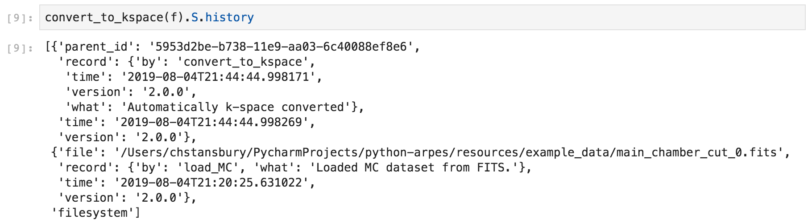
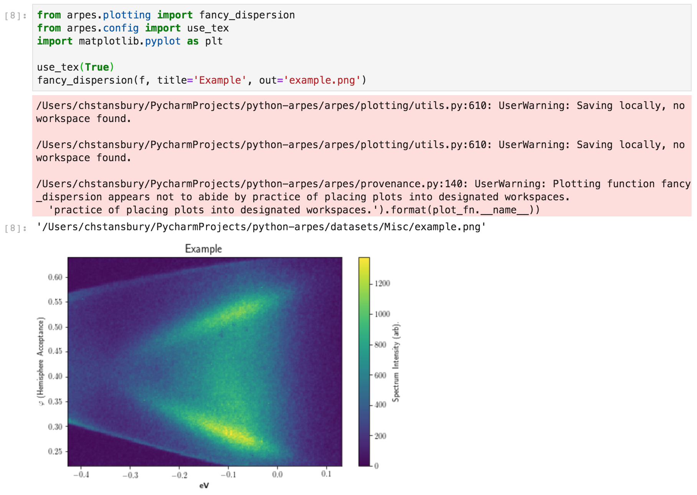
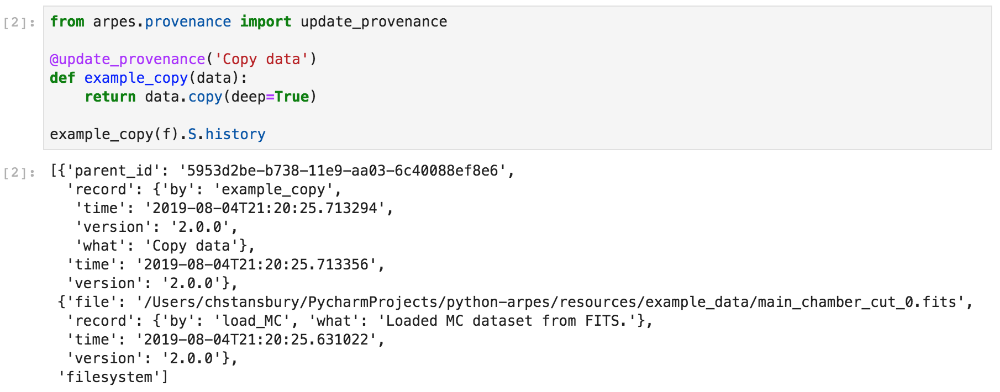
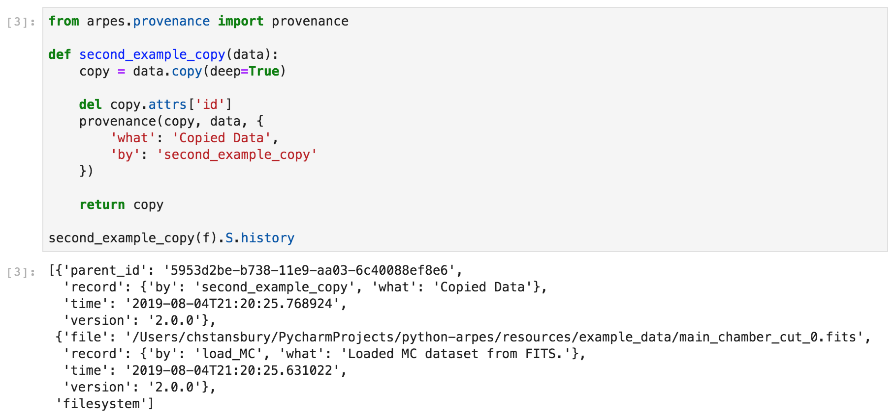

# Data Provenance

One of the goals of PyARPES is to allow for 
reproducible and easily introspectable 
scientific analysis. It should be easy for an experimenter to 
go back to prior analysis notebooks or to figure and understand how it was made.
Similarly, reproducible science requires that *others* can do the same.

Even hygienic use of Jupyter notebooks is insufficient
to achieve true reproducible analysis because

1. Code can change
2. Data is mutable and a precise record of changes to data is not recorded
3. Finished analysis products like figures are not linked to analysis


PyARPES attempts to address these problems by maintaining a record 
of actions performed on data including functions, software version,
and parameters, when you use the builtin analysis routines.

This record is used to produce a lineage for the data involved in any figure
created using the PyARPES standard figures, or using the PyARPES `savefig`
wrapper.

PyARPES also provides tools that make it simple to record and maintain
data provenance for your analysis code.

## Format for data provenance

You can use `.S.history` to obtain the data provenance for data you work 
with in PyARPES. Provenance is available on `xr.DataArray` and `xr.Dataset` instances
and takes a nested list format, with IDs used for references. 


Most analysis routines that consume and produce `xarray` based data will
update this provenance record. 

Here we can see that converting to momentum space
includes a new item indicating the conversion. 



## Outputting provenance when plotting

After you've performed some analysis, you will want to produce plots, and 
you will want the provenance to stick around with the figure.

The built-in plotting scripts in PyARPES will save both the output figure, and 
a record of the data provenance. 



As an example, here we plot an ARPES cut: the figure is saved as 
"example.png", while the provenance for the data in the figure is recorded in the 
file "example.png.provenance.json".

After plotting, the provenance file contains:

```json
{
  "VERSION": "2.0.0",
  "args": [
    {
      "version": "2.0.0",
      "record": {
        "what": "Loaded MC dataset from FITS.",
        "by": "load_MC"
      },
      "time": "2019-08-04T21:20:25.631022",
      "parents_provenance": "filesystem",
      "file": "/Users/chstansbury/PycharmProjects/python-arpes/resources/example_data/main_chamber_cut_0.fits"
    }
  ],
  "kwargs": {},
  "time": "2019-08-04T21:43:39.581877",
  "name": "fancy_dispersion"
}
```

### Custom plots

Often you need to customize or write a one off plot. If instead of using Matplotlib's
`savefig` you use `arpes.plotting.savefig`, then the `data=` 
parameter allows you to request a provenance record for data in 
your custom plot. 


This records a provenance more or less identical to the previous example.

## Using provenance in your code

PyARPES makes it very straightforward to opt into recording provenance. If you write an 
analysis function, the simplest option is to use the `update_provenance` decorator,
which introspects data passed to and returned from your function at runtime
and updates provenance appropriately.   



If you need more control, you can also manually modify the provenance record


