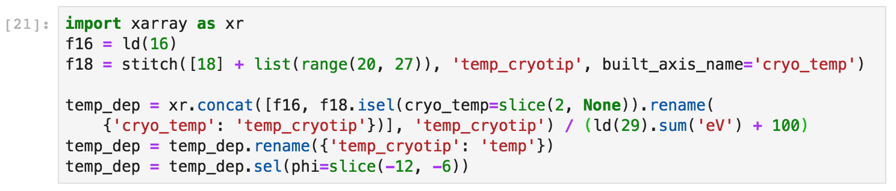

# Data Abstraction

The core data primitive in PyARPES is the `xarray.DataArray`. However, adding additional
scientific functionality is needed since `xarray` provides only very general functionality.
The approach that we take is described in some detail in the `xarray` documentation at 
[extending xarray](http://xarray.pydata.org/en/stable/internals.html#extending-xarray), which
allows putting additional functionality on all arrays and datasets on particular, registered 
attributes.

In PyARPES we use a few of these:

1. `.S` attribute: functionality associated with spectra (physics here)
2. `.T` attribute: general abstract functionality that could reasonably be a part of `xarray` core
3. `.F` attribute: functionality associated with curve fitting

**Caveat**: In general these accessors can and do behave slightly differently 
between datasets and arrays, depending on what makes contextual sense. 

This section will describe just some of the functionality provided by the `.S` attribute, while 
the [following section](/dot-T-functionality) will describe some of the functionality on `.T` and the section on 
[curve fitting](/curve-fitting) describes much of what is available through `.F`.

Much more can be learned about them by viewing the definitions in `arpes.xarray_extensions`.


## Shortcuts to plotting and interactive tools

Many shortcuts, especially to interactive plotting and interactive tools are included. 
They are described elsewhere, but include `.plot`, `.show`, `.show_d2`, `.show_band_tool`, 
`.fs_plot`, `.cut_dispersion_plot`, `isosurface_plot`, and a number of "reference" plots.

## Data selection

### `along`

A relatively common pattern, especially when dealing with a map or other three dimensional dataset,
is to select a representative subset of the data available. For ARPES, this often means taking just 
the dispersion along the high symmetry axes, or equivalently the cuts interpolating between the high
symmetry points. `.along` allows selection of data interpolated between a number of points, passed
as the second argument. For convenience, high symmetry points, if labeled in the data, can be 
interpolated by name.

As an example:

```python
f = ld(1)  # a map, with labeled Gamma and K points 
f.S.along(['G', 'K', 'M', 'G']) # produces a cut from Gamma to K to M and back to Gamma
```

Points can also be passed explicitly by coordinate and the two styles (labeled and explicit) 
can be mixed.

### `select_around` and `select_around_data`

As an alternative to interpolating, you can integrate in a small rectangular or 
ellipsoidal region around a point using `.select_around`. You can also do this for a 
sequence of points using `select_around_data`.

These functions can be run in either summing or averaging mode using either `mode='sum'` 
or `mode='mean'` respectively. Using the `radius` parameter you can specify the integration
radius in pixels (`int`) or in unitful (`float`) values for all (pass a single value) or 
for specific (`dict`) axes.

`select_around_data` operates in the same way, except that instead of passing a single point,
`select_around_data` expects a dictionary or Dataset mapping axis names to iterable collections of 
coordinates.

As a concrete example, suppose that we have a temperature dependence dataset `f` 
with axes `(eV, phi, T)` consisting of cuts at different temperatures. Suppose we wish to 
obtain EDCs at the Fermi momentum for each value of the temperature.

First we will load the data, and combine datasets to get a full temperature dependence.



Next we will fit the MDCs around the chemical potential as a function of temperature, including a 
linear background term and a single Lorentzian peak. For more details, see the section on 
[curve fitting](/curve-fitting).


With the values of the Fermi momentum (in angle space) now obtained, we can select EDCs as the 
appropriate mometum for each value of the temperature. In this case we will average the EDC in 
a window of 20 milliradian radius around the Fermi momentum. 


## Predicates

A number of predicates describing properties of the data are available at `is_X` for some property 'X'. 
Some choice examples: `is_subtracted`, `is_spatial`, `is_kspace`, `is_slit_vertical`, `is_synchrotron`, 
`is_differentiated`.

## Iteration

More facilities for iteration are also available on the [`.T` attributes](/dot-T-functionality)