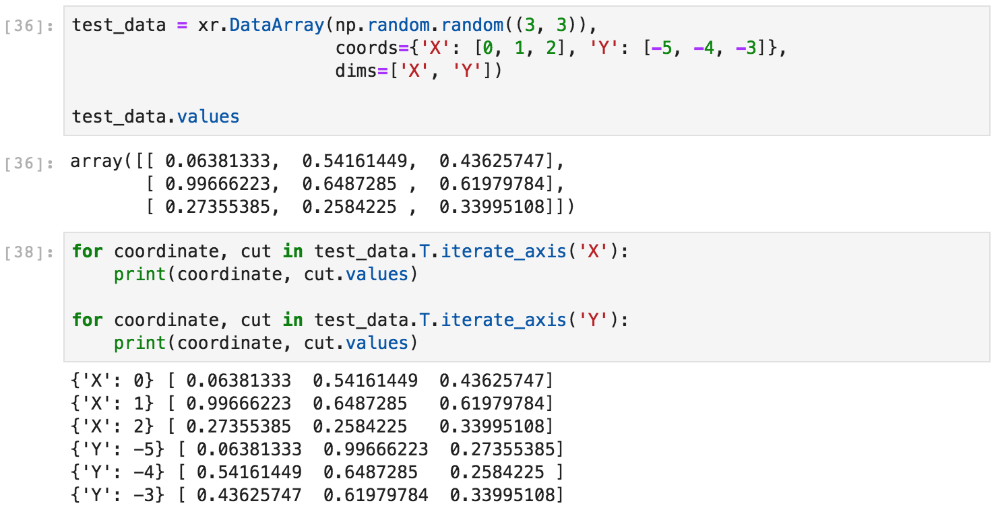
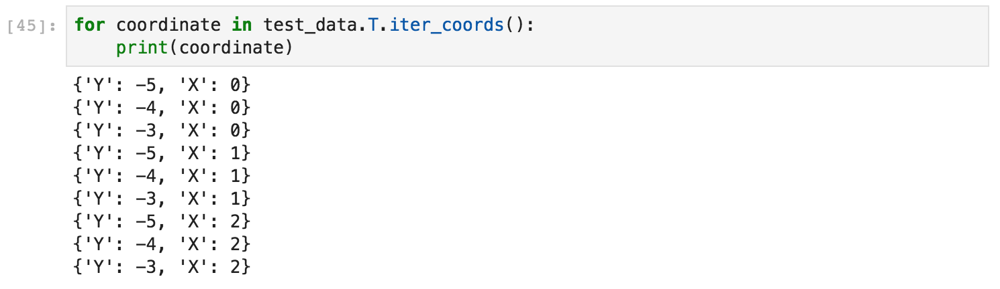
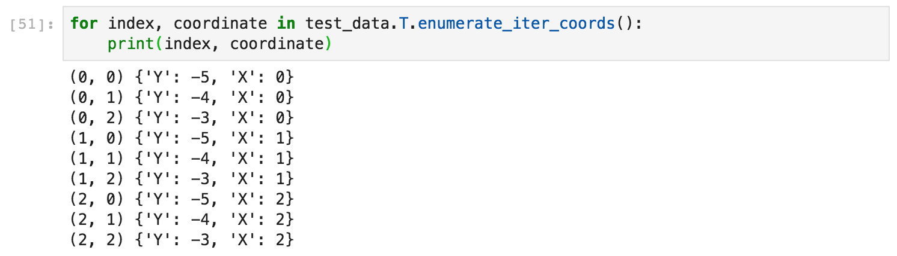
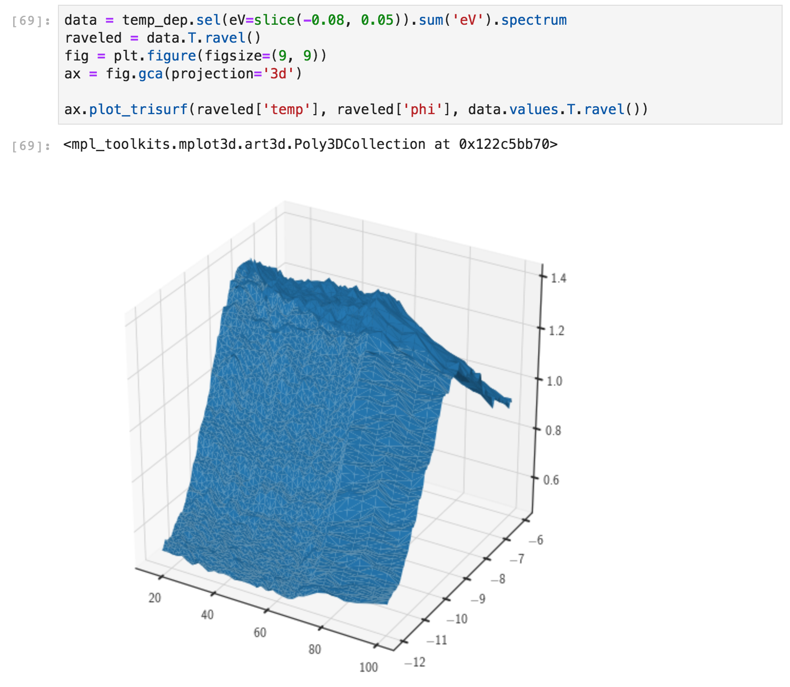
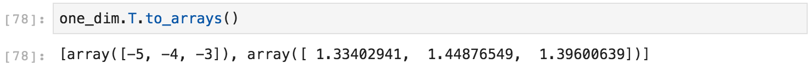
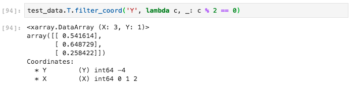
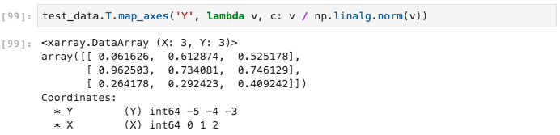
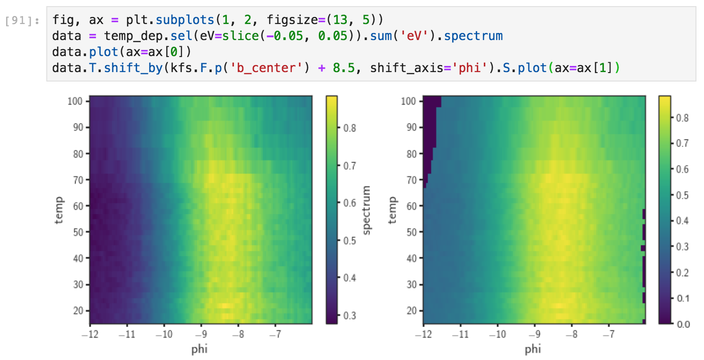

# General additions to xarray

In addition to ARPES specific additions, we add a number of features
to the xarray data types (`Dataset` and `DataArray`) available on the `.T` 
accessor. For more detail are defined in the class 
`arpes.xarray_extensions.GenericAccessorTools`.

## Iteration

### Iteration along one or more dimensions

`iterate_axis` allows iteration along one or more axes in the dataset. 
The produced value is a generator (you can think of this like a list) that
contains pairs of coordinate values for the dimensions specified for iteration,
and a cut of the data at those specific coordinates. As an example for ARPES,
this allows you to iterate along either EDCs or MDCs by using `.iterate_axis('phi')`
or `.iterate_axis('eV')` respectively.

Here's an example:

### Iteration only across coordinates

`iter_coords` allows one to iterate across only the coordinates of a `DataArray`,
without also iterating across the data proper. This can be useful if you would like
to transform the coordinates before selection, or would only like access to the 
coordinates.

You can also iterate simultaneously over the coordinates and their indices in the data with
`enumerate_iter_coords`.

## Raveling/flattening

It is sometimes necessary to have access to the data in a flat format where each 
of the coordinates has the full size of the data. The most common usecase is in 
preparing an isosurface plot, but this functionality is also used internally in
the coordinate conversion code.

The return value is a dictionary, with keys equal to all the dimension names, plus
a special key "data" for the values of the array.

But we could have also used the tools in `arpes.plotting.visualize_3d`.

## Coordinate Manipulation

For one dimensional arrays, you can copy data into the coordinates and optionally rename the 
coordinate with `coordinatize`. This is useful as preparation when you are about to forward 
convert a dataset's coordinates to momentum space. 

You can also get a flat representation of the coordinates and data of a one dimensional dataset using
`to_arrays`. This is especially valuable since the result can be 
[* splatted](https://docs.python.org/3/tutorial/controlflow.html#unpacking-argument-lists) into an 
invocation of a scatter plot.  

## Functional Programming Primitives: filter and map

Filtrations, which remove or filter some values in a dataset according to a function/`sieve` which
accepts values, can be achieved with `filter_coord`. The sieving function should accept two arguments,
the coordinate and the cut at that coordinate respectively. You can specify which coordinate or 
coordinates are iterated across when filtering using the `coordinate_name` paramter.

As a simple, example, we can remove all the odd valued coordinates along Y:

Functional programming primitives can also be used to modify data. With `map` we can apply a function 
onto a `DataArray`'s values. You could use this to add one to all of the elements.

Additionally, we can simultaneously iterate and apply a function onto a specified dimension of the data
with `map_axes`. Here we can use this to ensure that the rows along 'Y' have unit norm.

## Shifting

Suppose you have a bundle of spaghetti in your hand with varying lengths. 
You might want to align them so that they all meet in a flat plane at the tops 
of the strands. In general, you will have to shift each a different amount 
depending on the length of each strand, and its initial position in your hand.

A similar problem presents itself in multidimensional data. You might want to shift 
1D or 2D "strands" of data by differing amounts along an axis. One practical use
case in ARPES is to [align the chemical potential](/fermi-edge-corrections) to take into 
account the spectrometer calibration and shape of the spectrometer entrance slit. Using 
the curve fitting data we explored in the [previous section](/dot-S-functionality), we can
align the data as a function of the temperature so that all the Fermi momenta are at 
the same index: 

## Plotting Primitives

`as_movie` can be used to convert a 3D dataset into a movie, where the 
"time" dimension can be chosen. This is a thin wrapper around 
`arpes.plotting.plot_movie`.