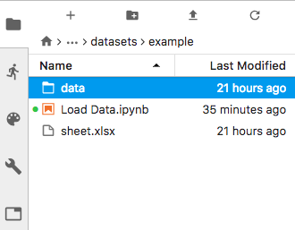

# Get Started with PyPES

PyPES is an open-source data analysis library for spectroscopy research and tool development. While the scope of what 
can be achieved with PyPES is general, PyPES focuses on creating an productive programming and analysis environment for 
Angle Resolved Photoemission Spectroscopy (ARPES) and its derivatives (Spin-ARPES, ultrafast-ARPES, 
ARPE-microspectroscopy).

As part of this mission, PyPES aims to reduce the feedback cycle for scientists between data collection and 
producing publication quality analyses and figures. Additionally, PyPES aims to be a platform on which new types 
of ARPES and spectroscopic analyses can be rapidly prototyped and tested.

For these reasons, PyPES includes out of the box a **large variety of analysis tools** for

1. Applying corrections to ARPES data
2. Doing gap analysis
3. Performing sophisticated band analysis
4. Performing rapid and automated curve fitting, even over several dataset dimensions
5. Background subtraction
6. Dataset collation and combination
7. Producing common types of ARPES figures and reference figures
8. Converting to momentum space
9. Interactively masking, selecting, laying fits, and exploring data

These are in addition to facilities for derivatives, symmetrization, gap fitting, 
Fermi-Dirac normalization, the minimum gradient method, and others.

## Tool Development

Secondary to providing a healthy and sane analysis environment, PyPES is a testbed for new analysis and 
correction techniques, and as such ships with `scikit-learn` and `open-cv` as compatible dependencies for 
machine learning. `cvxpy` can also be included for convex optimization tools.

# Running the Example Analysis 

## Workspaces

PyPES makes a few assumptions about the organization of your data and analysis so that it can organize figures and 
cross-reference data from the same sample or experiment. In the desired location (for instance your Documents folder
or wherever you would like to keep your analysis notebooks), copy or clone the folder structure from the
[arpes-analysis-scaffold repository](https://gitlab.com/lanzara-group/arpes-analysis-scaffold).

Separate analysis workspaces are stored as folders inside `datasets`. All data for a given project/workspace is 
stored in the `data` folder inside a workspace. Once you have copied the analysis scaffold structure, start a Jupyter session, inside the `example` 
folder you should find the files:

Every project will have roughly this structure at its core: a `data` folder with the raw data for analysis,
some or many analysis notebooks, and one or more spreadsheets which the analysis code uses to order and add 
extra information to the raw data.

The analysis code will only load data that is listed in a spreadsheet. A minimal spreadsheet includes two columns: 
`file` and `location` 

`file` refers to a fragment of the filename or the file index for the raw data inside `data`, while `location` 
indicates which lab spectrometer or synchrotron endstation produced the data (necessary to automate data-loading).
Currently most ARPES endstations at the Advanced Light Source (ALS) are supported 
(location values: BL4, BL403, BL7, BL702, BL10). More endstations can be added quickly as [plugins](/writing-plugins).

## Configuring

Because you have the freedom to place your analysis folder wherever you like, PyPES has to be told where 
you put it. You can either perform this configuration in an IPython Kernel startup script (see for 
instance [this guide](http://www.gilgalad.co.uk/post/jupyter-kernel/) or talk to Conrad), or just run 
the `setup` function, which will also import useful pieces of code into the global scope.

The second argument should be the full path to the folder containing the `datasets` and `figures` folder. 
This should be performed at the top of every notebook you use, or in your kernel startup, which has the same effect.

That's all! You can move onto [loading data](/loading-data)!