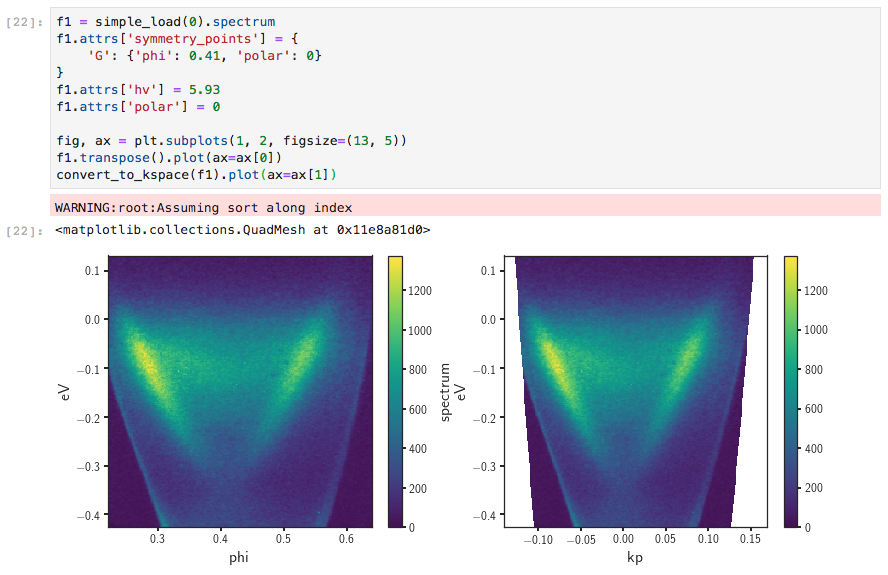
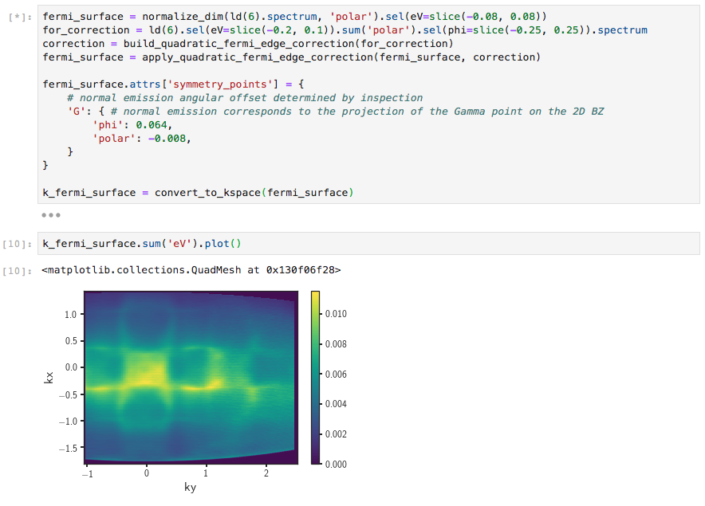
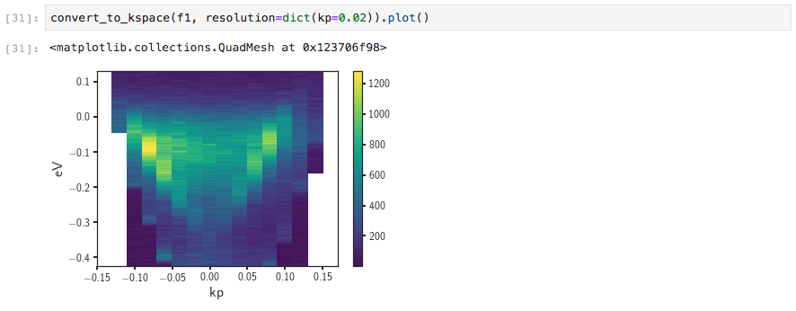

# Converting ARPES Data to Momentum-Space

## Converting Volumetric Data

PyARPES provides a consistent interface for converting ARPES data from angle to momentum space.
This means that there is only a single function that provides an entrypoint for converting 
volumetric data: `arpes.utilities.conversion.convert_to_kspace`.

You will need to provide some data, including angular coordinates of normal emission (provided by 
setting 'G' in the symmetry points), as well as potentially the photon energy and base coordinate 
values, if these are not provided by your data acquisition hardware in the loaded file.

For photon energy dependence scans, you can also set the attribute `inner_potential`, and the 
`work_function` can be set for all scans as well.

Converting a single cut is straightforward.

We can also first correct for the slit distortion to the chemical potential for full map, 
before converting an entire Fermi surface.  

### Requesting a Resolution

PyARPES attempts to pick resolutions in the destination coordinate space that match the gridding
in the original space. You can override them however, by passing a resolution for any of the 
destination coordinates which will be used when creating the grid to interpolate onto. 

If you use this technique, consider also binning your data to take advantage of higher SNR, because 
only nearest neighbors are used for interpolating.

## Converting Coordinates

Whereas to convert volumetric data to momentum space, we create a uniform grid in the destination
coordinate (momentum) space and interpolate the value on this grid by backwards converting, 
the coordinates can be converted forwards directly for one dimensional data. This is particularly 
useful for plotting the actual kz momentum dispersion across a cut, or plotting the segment
seen in an experiment or by the spectrometer.

As an example, we can use the forward coordinate conversion to plot the accessible parallel momentum 
values as a function of the polar angle from normal emission.

**Note:** Because of the intrinsic differences between converting volumetric and coordinate (1D) data,
you should tend to use `convert_coordinates_to_kspace_forward` when plotting orientations and cuts
