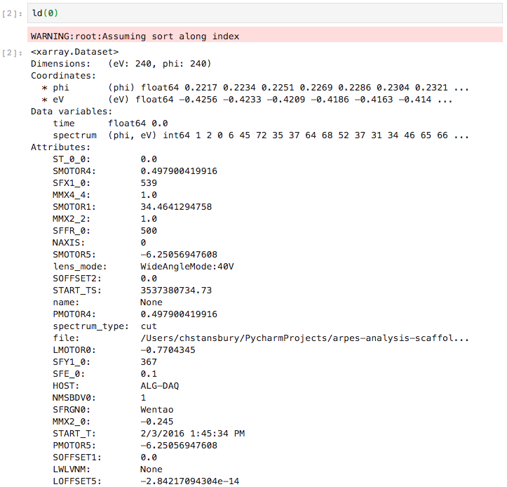

# Loading and Normalizing Data

## (Optional) Normalizing Data

ARPES data like spectrometers comes in many forms. Unfortunately this makes it less convenient to work with. 
As a first step in analysis, we simply normalize all our data to the NetCDF format.

If you opt to normalize your data, a new copy will be generated in a global cache indexed by UUIDs. 

This step only needs to be performed once per project.

## Loading a single file

Data can be loaded using its index or canonical (normalized) UUID. This programmatic interface 
allows for expressive analysis scripts that can perform a particular data analysis across all of your cuts, 
or across an experimental degree of freedom like the sample temperature.

Optionally, you can pass `ld` or its siblings a `workspace=` argument to load data
from a different workspace.

As we can see, the loaded data takes the form of an xarray `Dataset`. For those coming from a Python background,
xarray objects are very much like pandas' `DataFrames`, except that they can be multidimensional. For those from
an Igor background, `Dataset`s and `DataArray`s are very similar to waves, except that they can host attached 
attributes, allow for more expressive selection and manipulation (see the [following section](/basic-data-exploration)),
and have axes labelled not by a number but by a physically significant name (here, the hemisphere axes: 'eV', 'phi').

Read more about the [data format for spectra in PyARPES](/spectra) or continue to the section on 
[basic data exploration](/basic-data-exploration).

## Loading Several Files

You can also use `arpes.io.stitch` in order to combine several pieces of data along an axis at load time.