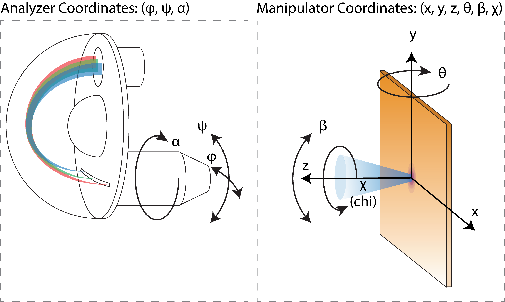
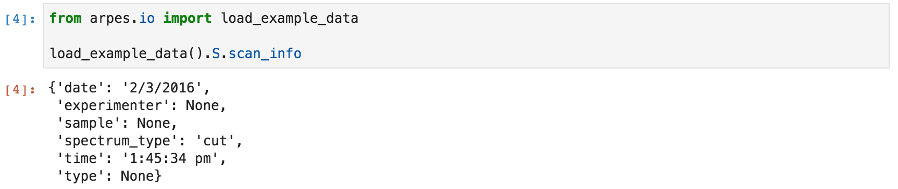
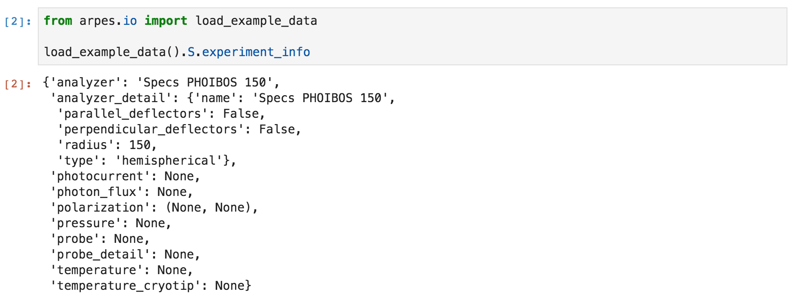
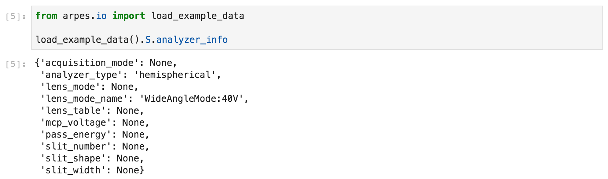
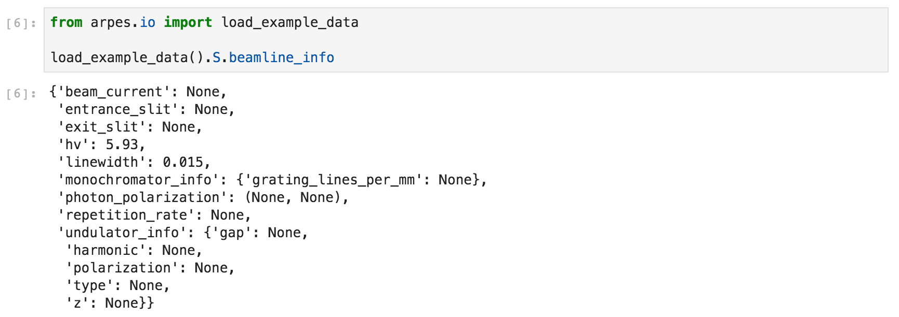
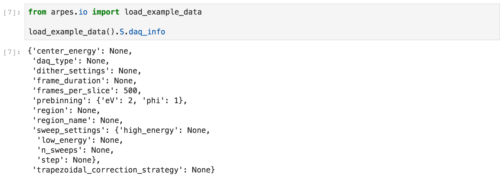
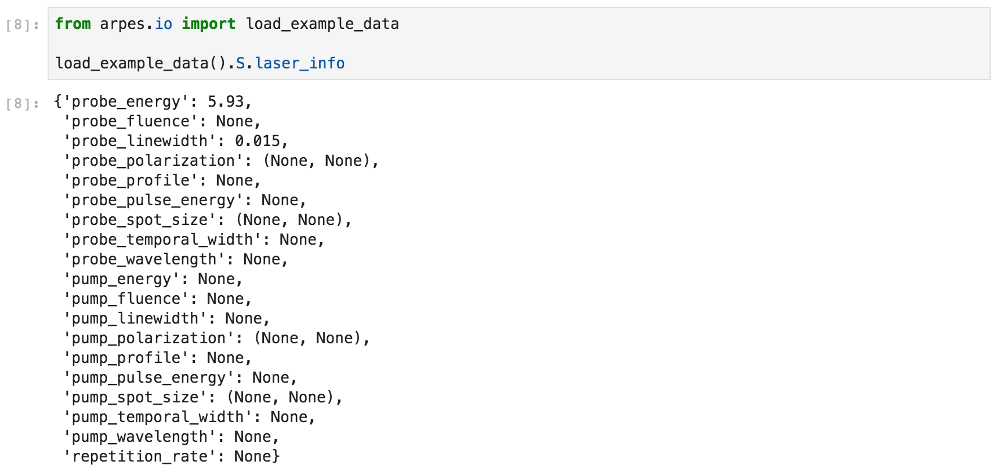
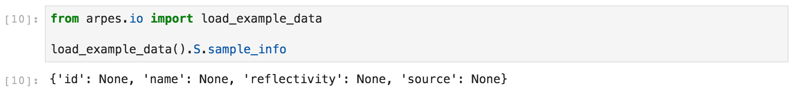

# The PyARPES Data Model and Conventions

## Coordinate conventions

The PyARPES coordinate representation is summarized in the figure below. 
Three spatial coordinates specify the manipulator translation relative 
to a fixed origin. Two manipulator angles ("theta" and "beta") specify the
orientation of the sample normal relative to the analyzer axis. A final azimuthal 
angle "chi" specifies the rotation of the sample face.

These six angles are not enough to fully specify the photocurrent though,
because the analyzer observes an angular cut which can be sometimes independently
manipulated. The angle along the analyzer slit is always labelled as "phi",
while the angle perpendicular to this one is labelled as "psi". This psi angle 
will be familiar to those using a deflector that allows recording Fermi surfaces
without sample motion. Finally, some analyzers allow rotation
along the analyzer axis. This is the "alpha" angle. As a convention
we will take alpha=0 when the the slit of the analyzer is in the x-z plane.

## ARPES Metadata

Convenient and consistent metadata conventions are essential in data analysis. 
Without consistent conventions, even basic analysis has to be done essentially manually 
and cannot easily be reused. Furthermore, offering convenient conventions for 
metadata reduces friction inherent in starting analysis for on data from new beamlines. 

PyARPES offers strong metadata support for experiments conducted at
synchrotron beamlines and those performed with lasers. Ultimately, the 
quality of metadata you get is limited by what is included in the data by the DAQ software.

To help mitigate this, all spreadsheet columns are attached to the appropriate 
data, allowing you to manually specify metadata that is not otherwise
recorded by default. 

#### Units

Spatial and angular coordinates are reported in millimeters and radians respectively.
Temperatures are everywhere recorded in Kelvin. 
Relative times are reported in seconds. Currents are recorded in nanoamp unit.
Pressures are recorded in torr. Potentials are recorded in volts.
Laser pulse durations and other pump-probe quantities are reported in picoseconds.
Energies are reported in electron volts. Fluences are reported in units of micro-Joules per square centimeter. 
Frequencies are reported in Hz.

Deviations from these units are reported as relevant below. 

### Coordinates

Coordinates are the most important metadata available. PyARPES
guarantees that every piece of data loaded through the provided plugins
contain the photon and binding energies as well as all of the six analyzer and 
sample angular coordinates. The physical sample position in millimeter units is also
provided.

### Scan Information

This includes coarse information about the scan that was performed to collect 
this ARPES data. You can access it at `.S.scan_info`

#### A Note on Polarizations

In order to be able to represent elliptical polarizations, 
PyARPES reports photon polarizations in 
(rotation angle, phase angle) format.

### Experiment Information

You can access the experimental conditions with the 
`.S.experiment_info` accessor.

### Analyzer Settings

### Beamline Settings

Metadata about the beamline is collected under `.S.beamline_info`

### Data Acquisition Settings

Metadata about data acquisition settings is collected under `.S.daq_info`.
Because DAQ information depends highly on the implementation of DAQ programs,
this collection of metadata varies somewhat across beamlines and sources.    

### Laser/Pump-Probe Information

### Sample Information

## The Sign of the Binding Energy

PyARPES makes a choice to represent the binding energy as negative below the 
Fermi level, this is opposite of the physical value (you can think of it instead
as the photoelectron kinetic energy but offset to align zero energy at the 
Fermi level). Nevertheless, it has the advantage of making math simpler, and 
orienting plots and figures in an aesthetically pleasing way.