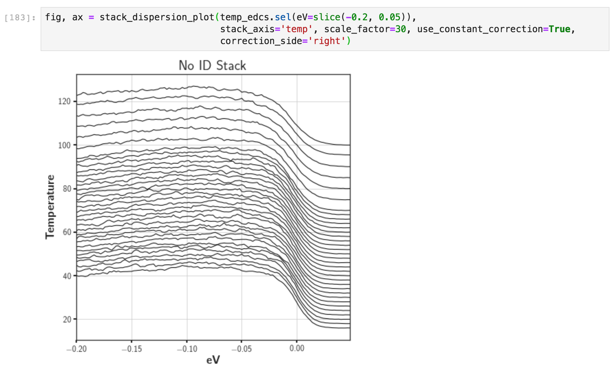
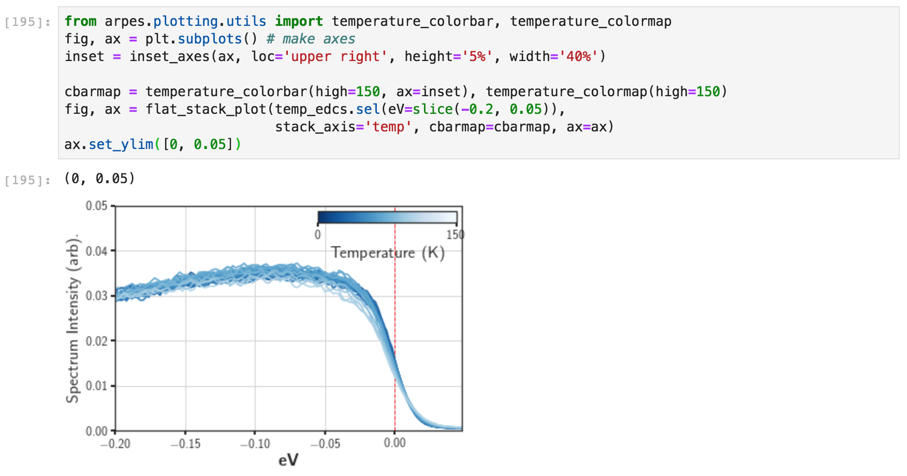

# Stack Plots

Stacked line plots, typically used to highlight some change in a 
lineshape as a function of an experimental degree of freedom or to
better present the dispersion of a band, are among the most bread 
and butter of ARPES figures.

Because of their ubiquity, PyARPES offers two principal styles, 
differing in whether the lines are shifted and stacked, or all aligned
but with varying color (often better for highlighting lineshape or
gap change).

## Traditional stack plots

You can get a stack plot with `arpes.plotting.stack_dispersion_plot`. 
The scale can be adjusted with `scale_factor=`, and the axis along which
the data is stacked can be controlled with `stack_axis=`. Here we will use 
the temperature dependent EDCs at the Fermi momentum from our curve 
fitting explorations. 

To change the alignment characteristics to something more reasonable,
we can request a constant offset, and snap the right side of the lines
to the appropriate shift values. 

## "Flat" stack plots

In addition to actually stacked line plots, we can opt to differentiate the 
lines by color while keeping them overlapped. This can be accomplished by 
`arpes.plotting.flat_stack_plot`, which acts very similar to the above.

Although PyARPES will attempt to make a reasonable default guess for the colorscale,
here identifying that the stack axis is along the experimental temperature and giving
a colorbar from 0K to room temperature, we can also control the colorbar
and plot them onto custom axes with `cbarmap=`. 
Utilities for colorbars are [discussed later](/plotting-utilities).

Finally, as an example of how you might use the code in a real situation, we 
can do some preprocessing of the data before creating the figure. Here we subract 
and normalize by the low temperature data, which highlights the Fermi edge 
width changing.
 

